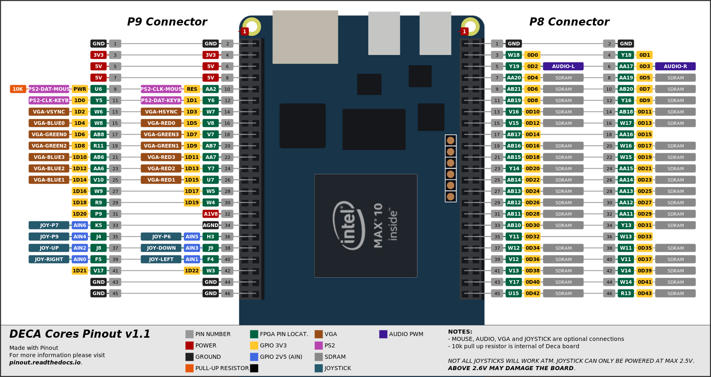

# Soc lesson 12 DeMiSTify example

06/12/21 Deca port DeMiSTified by Somhic from original MiST SoC tutorial lesson 12 https://github.com/mist-devel/mist-board/tree/master/tutorials

Special thanks to Alastair M. Robinson creator of [DeMiSTify](https://github.com/robinsonb5/DeMiSTify) for helping me. 

[Read this guide if you want to know how I DeMiSTified this core](https://github.com/DECAfpga/DECA_board/tree/main/Tutorials/DeMiSTify).

**Features:**

* HDMI video output
* VGA 444 video output is available through GPIO (see pinout below). 

**Additional hardware required**:

- PS/2 Keyboard connected to GPIO  (see pinout below)

##### Versions:

v0.1 initial release

### Instructions to compile the project for a specific board:

(Note that rbf/sof/svf files are already included in /deca/output_files/)

```sh
git clone https://github.com/DECAfpga/xxxxxxxxxxxxxxxx
cd xxxxxxxxxxxxxxxx
cd soc12
git submodule add https://github.com/robinsonb5/DeMiSTify.git
git submodule update --init 


#Do a first make (will finish in error) but it will download missing submodules 
make
#Checkout to the DeMiSTify branch with the latest updates
cd DeMiSTify
git checkout somhic
#Create file site.mk in DeMiSTify folder 
cp site.template site.mk
#Edit site.mk and add your own PATHs to Quartus (Q19)
gedit site.mk
#Go back to root folder and do a make with board target (deca, neptuno, uareloaded, atlas_cyc). If not specified it will compile for all targets.
cd ..
make BOARD=deca
#when asked just accept default settings with Enter key

```

After that you can:

* Flash bitstream directly from [command line](https://github.com/DECAfpga/DECA_binaries#flash-bitstream-to-fgpa-with-quartus)
* Load project in Quartus from /deca/xxxxxxxxxxxxxxxxx_deca.qpf

### Pinout connections:



For this core is just needed to connect PS2 keyboard signals.

For 444 video DAC use all VGA pins. For 333 video DAC connect MSB from addon to MSB of location assignment (e.g. connect pin VGAR2 from Waveshare addon to VGA_R[3] Deca pin).

**Others:**

* Button KEY0 is a reset button

### STATUS

* Working fine

* HDMI video outputs special resolution so will not work on all monitors. 

### OSD Controls

* F12 show/hide OSD 
* The reset button KEY0 resets the controller (so re-initialises the SD card if it's been changed, reloads any autoboot ROM.) The OSD Reset menu item resets the core itself.

